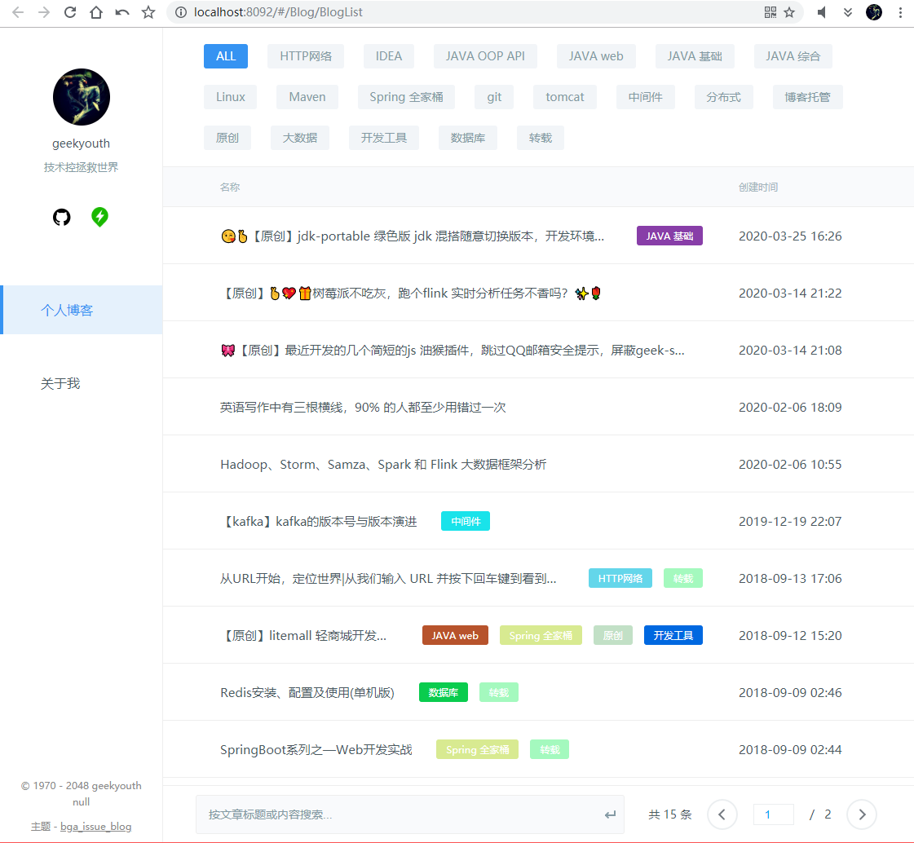

    <h1>极客青年博客</h1>

    

👣极客青年博客😘，基于github pages+issues + VUE 2.0 框架构建的轻量级静态博客系统💎

在线体验 <https://geekyouth.github.io> | <https://java666.cn>

issue 访问：<https://github.com/geekyouth/blogs/issues>

------

------

💓💓💓

## 简介：

早些年折腾过很多博客和网站，包括但不限于：

1-免费的谷歌云【主要用来翻墙上网】；

2-超高性价比的景安云虚拟机，年费49元甚至一元，老牛拉破车还可以将就wordpress博客站点；

3-小鸟云没啥特色，用过几天就没管了；

4-各种套路云基本都试过，尤其是反面教材主机屋；

5-各种类型的博客系统，wordpress 用的最久最后无心经营搁置了；

6-公众号也没时间推送，各种新媒体头条号简书之类的平台规则太多了，而且排版非常麻烦耗时间；

7-接触了静态博客hexo +github pages 过了新鲜劲也觉得更新挺麻烦的；

------

这些东西要么需要大量的时间调整主题模板和seo优化，要么需要复杂的排版和上传步骤以及高昂的时间、人力维护成本，总之就是超级耗时间，如今对我来说最贵重的就是时间了。搜遍了 Google 发现有个全栈开发大神 “Kenshin Wang”【简阅 chrome 开源插件的作者】的一篇文章：

为什么使用 Github issues 作为我的新博客？| http://kenshin.wang/blog/#/posts/1

看完之后茅塞顿开恍然大悟，于是顺藤摸瓜，看到这篇：

如何用Github Issues写技术博客？| https://www.jianshu.com/p/7c2cce028d29

我虎躯一震，发觉直接用Github的 Issues + Projects，写技术博客能够更加专心内容本身，而不是去关心并不那么重要的UI 和精美特效杀马特非主流的粒子振动，于是后面就打算在github issues <https://github.com/geekyouth/geekyouth.github.io/issues> 更新博客。

本项目基于原作者 [https://github.com/bingoogolapple/BGAIssueBlog] 构建，感谢bingoogolapple 开源！！！

---

## 免责声明：

本博客是为了便于本人存档学习笔记的，如果你有看不懂的内容尽量忍一忍🤣。因为大部分内容是写给我自己看的，请勿介意🙄😏😗。

---

## 如何部署到github pages？

https://github.com/bingoogolapple/BGAIssueBlog

## 我遇到的坑：

npm install 过程并不顺利，于是改用 cnpm install 就好使了，希望可以帮到你；

其次，github 项目名称必须严格遵守格式 “你的账户id.github.io” ，而且github pages 必须部署在master 分支，之后一切水到渠成。

---

## 博客内容分类：

- Linux/Shell/Docker
- 数据库/中间件/运维/监控
- JAVA/Scala
- SpringBoot 全家桶
- 分布式架构系统
- 大数据生态 Hadoop+Spark+Kafka+Hive+Flink+CDH
- 开发工具 JB 全家桶
- 综合
- 待整理

------

💓💓💓

## 关于我：

大数据开发工程师，常用技术栈：

- HTML、CSS、JavaScript
- JAVA、Scala、Shell、SQL
- 爬虫、Jsoup、抓包、数据库Mysql/Redis/Elasticsearch/MongoDB、中间件Kafka/ZK、Linux、Git、Maven、SpringBoot、SSM
- Centos6/7 集群部署运维、Docker/Compose
- Flume、Hadoop、Hive、Impla、HBase/Phoenix、Spark、Flink、CDH、Sqoop、Azkaban、Oozie、Kylin、Kettle...

---
只要学不死，就往死里学...

---

## 专注于：

大数据开发、JAVA 微服务。

---

## 业余爱好：

撸代码，逛 IT 社区（Github、v2ex、头条科技板块、各种 IT 技术公号），压榨树莓派，喜欢折腾各种生产力工具【电脑拆装换软硬件、路由器刷机 DIY、最喜欢工作和赚钱】，痴迷于技术。

------

💓💓💓

一直后台运行的几个生产力工具、神器推荐给你：

- Listary |快捷启动和搜索，一键搜 mvn|Github|Docker 仓库
- Everything |专业级本地搜索工具，支持高级筛选
- Wgestures |全局鼠标手势，懒人福音
- Fxsound |音频增强谁用谁知道啊
- 天若OCR识别 |再也没有比这个更方便的图片文字识别工具
- ShareX |github star 8k+ 地表最强截图神器、图床神器、gif 录屏神器、秒杀所有截图软件包括但不限于pickpick+sinapaste+QQ截图+所有图床
- Ditto |地表最强开源剪贴板，kafka 又臭又长的命令全靠他了

------

## 更新日志
- v2 ：修改 主页左上角的站外链接：<https://up.java666.cn/>

---

💓💓💓

## 致谢：

> 作者：[bingoogolapple](https://github.com/bingoogolapple)  
 https://github.com/bingoogolapple/BGAIssueBlog
